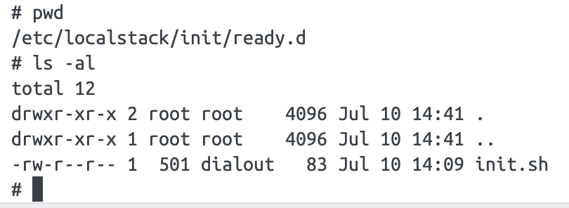
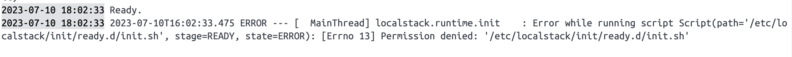

# LocalStack w/ Testcontainers Init Hooks Example

This repo is a small sample of how to use initialization hooks with the LocalStack container using Testcontainers.

A `discuss` question sparked this little quest. The post contained a code snippet of a LocalStack container setup for testing.


## Two scenarios

### The premise

The Docker image used for the LocalStackContainer was `localstack/localstack:2.1.0`, the latest version at that point. The setup
would copy an initialization script to the container using the `/docker-entrypoint-initaws.d` path.

```
  @Container
  protected static final LocalStackContainer localStack =
      new LocalStackContainer(DockerImageName.parse("localstack/localstack:2.1.0"))
          .withCopyFileToContainer(
              MountableFile.forClasspathResource("init.sh"),
              "/docker-entrypoint-initaws.d/init.sh");
```

Now `/docker-entrypoint-initaws.d` has been **deprecated** with the release of v2. However, if, for example, the user is still
relying on v 1.4.0, this would work, although I noticed that with Testcontainers, the tests can become inconsistent 
with this approach as sometimes the resources are not ready in time for the client call. Adding a 0.5-second delay can help 
the tests stay green with consecutive runs. A more elegant way of doing that is waiting for the resource to become available.
In this case, an `awslocal` command executed in the container looks like this:

```
localStack.execInContainer("awslocal", "s3api", "wait", "bucket-exists", "--bucket", "important-files");
```

v 1.4.0 also runs the scripts without explicitly making them executable. 

### Init Hooks

If we check the documentation page, we'll notice a new file structure, with each lifecycle phase having its own directory:
https://docs.localstack.cloud/references/init-hooks/. 
We'll use this approach to replace the container path with `/etc/localstack/init/ready.d/init.sh`. `Ready` is the phase
when LocalStack can accept requests. As I mentioned before, if there are many resources to be created at startup, 
then waiting for them to be available is a relatively straightforward approach.

One last thing: the file needs to be **executable** to ensure the script runs. You can check inside the container if this 
is causing any trouble:



In this case, there's a noticeable error message:



You can make your file executable by running `chmod +x init.sh`. If the issue persists, make sure you clean the
`/target` folder, otherwise the tests will use the previous file permissions that are tied to the `init` script in 
`target/test-classes/init.sh`.

Another way to do this would be to tell Testcontainers to set the desired mode explicitly.
This way our snippet becomes:

```
@Container
  protected static final LocalStackContainer localStack =
      new LocalStackContainer(DockerImageName.parse("localstack/localstack:2.1.0"))
          .withCopyToContainer(
              MountableFile.forClasspathResource("init.sh", 775),
              "/etc/localstack/init/ready.d/init.sh");
```

The file mode `775` was mainly chosen for ease of use. It is commonly applied when you want to grant read, write, and execute permissions to the owner and group,
while allowing read and execute permissions to others. 

## Conclusion

Make sure you always check the documentation for the latest updates on new versions of LocalStack, and you can always reach out on
[discuss](https://discuss.localstack.cloud/) or [Slack](https://localstack-community.slack.com).

You can learn more about [Testcontainrs](https://java.testcontainers.org/) on their site.
